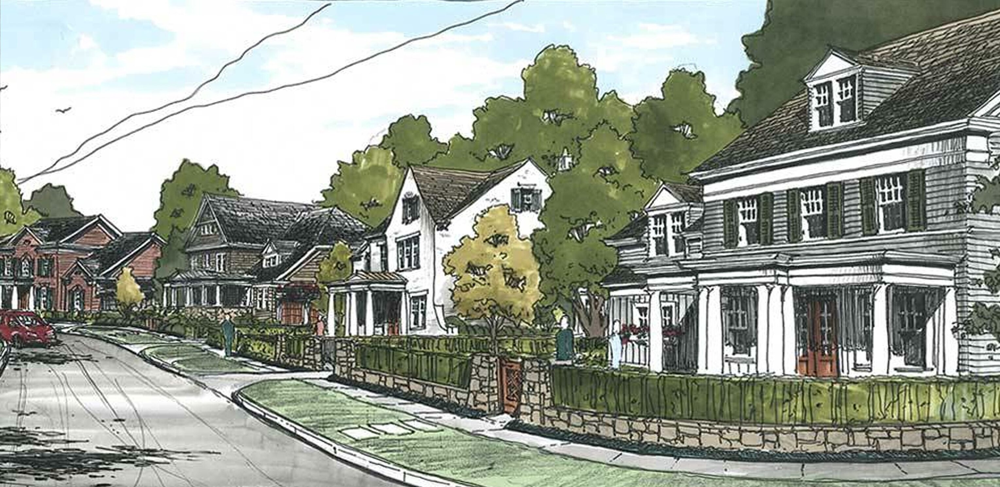

# Ames house prices project

&nbsp;

*Artwork* by <a href="https://www.ashtonwoods.com/inspiringspaces/architecture/drawing-techniques-how-they-enhance-design">Ashton Woods</a>

&nbsp;

<a href="https://www.cityofames.org/">Ames</a> is a city in Story County, Iowa, United States, located approximately 30 miles north of Des Moines in central Iowa. It is best known as the home of Iowa State University, with leading agriculture, design, engineering, and veterinary medicine colleges.

&nbsp;

The goal of this project is to develop a machine learning regressor able to predict the final price of a house using 79 explanatory variables of the Ames Housing dataset.

&nbsp;

## About the data
<a href="http://www.amstat.org/publications/jse/v19n3/decock.pdf">The Ames Housing dataset</a> was compiled by Dean De Cock for use in data science education. It's an incredible alternative for data scientists looking for a modernized and expanded version of the often cited Boston Housing dataset. It is a classic dataset used in data science education and can be downloaded from <a href="https://www.kaggle.com/c/house-prices-advanced-regression-techniques/data">kaggle</a>.

